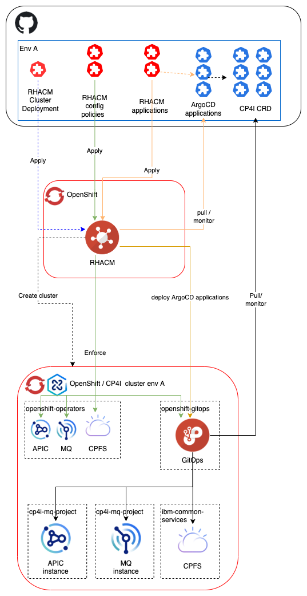

# Deploy CP4I applications with RHACM and RH GitOps

This repository contains the code (yaml file) used on the demonstration about deploying CP4I application with RHACM and RH GitOps

The demonstration uses the following architecture. 

*NB: the demonstration is focused on the application deployment. The creation of managed cluster from RHACM is not covered into this demonstration.*  

The demonstration shows :
* RH GitOps deployment with a RHACM policy.
* Deployment of IBM Operators catalog and needed operators on mananged cluster with RHACM policies
* Deployment of IBM Cloud Pak foundational services instances. The deployment is start ith a RHACM application that delegate the execution to ArgoCD application.
* Deployment of IBM MQ instance. The deployment is start ith a RHACM application that delegate the execution to ArgoCD application.

The [docs directory](./docs) contains more information about the used capabilities (RHACM policies, RHACM application, RH GitOps / ArgoCD application) and the choices made for this demonstration. 